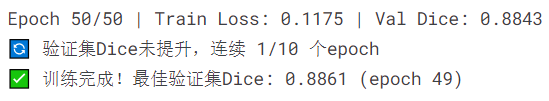
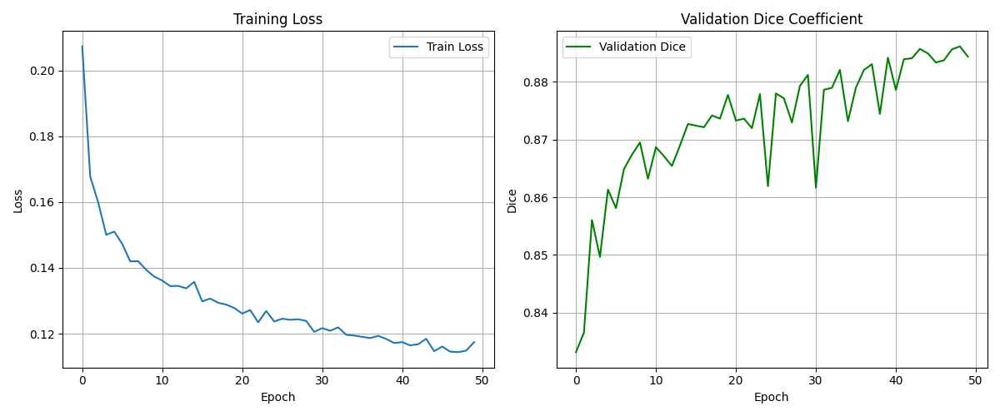
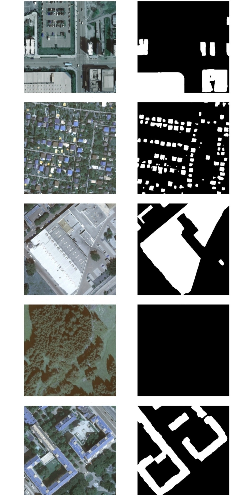
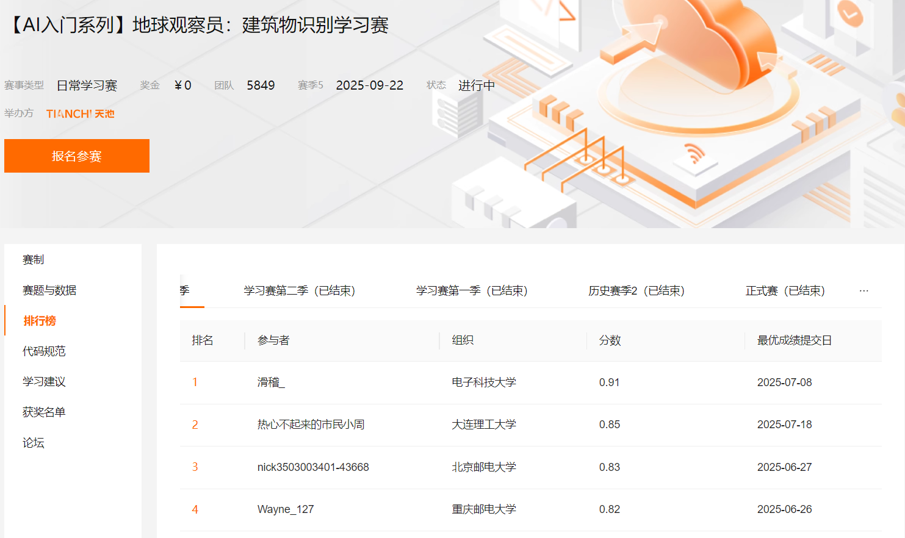

# **建筑物分割**


## 项目介绍

本项目是一个基于深度学习的建筑物分割系统，使用PyTorch框架和U-Net架构实现。主要功能是从航拍或卫星图像中精确分割出建筑物区域。项目采用先进的图像分割技术，结合数据增强和早停机制，能够在有限的数据集上实现较好的分割效果。

核心特点：

- 使用EfficientNet-B4作为编码器的U-Net模型，兼顾精度和效率
- 实现RLE(游程编码)格式的编解码，优化存储和传输效率
- 包含完整的数据增强流水线，提升模型泛化能力
- 采用Dice系数作为评估指标，更适合分割任务
- 实现早停机制，防止过拟合并节省训练时间

本次项目源于：[【AI入门系列】地球观察员：建筑物识别学习赛](https://tianchi.aliyun.com/competition/entrance/531872/information)

数据集下载：

[原始数据：Buildings_Recognition-origin](https://www.kaggle.com/datasets/rexinshiminxiaozhou/buildings-recognition)

[处理后数据：Buildings_Recognition-processed](https://www.kaggle.com/datasets/rexinshiminxiaozhou/buildings-recognition-processed)


## 数据集说明

数据集（经过data.ipynb处理）包含以下内容：

- train/ : 训练集图像(JPG格式)

- train.csv : 训练集标签(包含图像文件名和RLE编码的建筑物mask)

- test/ : 测试集图像

- test.csv : 测试集标签

  

  数据格式要求：

- 图像尺寸建议为512x512像素

- 标签使用RLE编码存储，空字符串表示无建筑物

- 文件路径使用制表符分隔


## 文件夹格式

```makefile
Buildings_Recognition\
├── data.ipynb                # 数据预处理和分析文件
├── data\                     # 数据文件夹
    ├── README-data.md        # 数据集说明文档
    ├── data1\                # 原始数据文件夹
    ├── images\               # README-data图像文件夹
    ├── test.csv              # 测试集CSV文件
    ├── test\                 # 测试集图像文件夹
        ├── 006TE20QA8.jpg    # 测试图像文件
            ...
    ├── test_a\               # 测试集A文件夹
    ├── train.csv             # 训练集CSV文件
    ├── train\                # 训练集图像文件夹
    └── train_mask.csv        # 原始训练集mask的RLE编码文件
├── log\                      # 训练日志文件夹
├── output\                   # 输出文件夹
    ├── model\                # 模型文件
    └── pic\                  # 结果图片
├── predict.py                
├── requirements.txt
├── train.py                  
└── README.md
```


## 功能实现逻辑

### 1. 数据预处理
- BuildingDataset类 ：
  
  - 自动处理文件名大小写问题
  - 自动添加文件扩展名
  - 处理缺失文件情况(创建空白图像)
  - RLE解码转换为二值mask
- 数据增强 ：
  
  - 随机水平/垂直翻转
  - 随机旋转90度
  - 随机亮度/对比度调整
  - 标准化处理(使用ImageNet均值方差)
### 2. 模型架构
- U-Net with EfficientNet-B4 ：
  - 编码器部分使用预训练的EfficientNet-B4
  - 解码器部分实现标准的U-Net结构
  - 输出单通道logits
### 3. 训练流程
- 损失函数 ：Dice Loss(直接从logits计算)
- 优化器 ：Adam(lr=0.001)
- 早停机制 ：验证集Dice系数连续5个epoch不提升则停止
- 模型保存 ：保存验证集表现最好的模型
### 4. 评估指标
- Dice系数 ：衡量预测mask与真实mask的重叠程度
- 可视化 ：展示原图、真实mask和预测mask的对比


## 快速开始

1. 安装依赖：

```bash
pip install -r requirements.txt
```

2. 训练模型：

```bash
python train.py
```

3. 配置参数(在train.py中修改)：

```bash
BATCH_SIZE : 批次大小(默认8)
LR : 学习率(默认0.001)
EPOCHS : 最大训练轮数(默认50)
PATIENCE : 早停耐心值(默认5)
```


## 结果展示

项目使用 Kaggle 平台提供的 GPU P100 进行训练，得到的最优模型结果如下：



训练损失记录如下：



随机选取的一些样本进行预测测试：



战绩可查  ∠( ᐛ 」∠)_：

