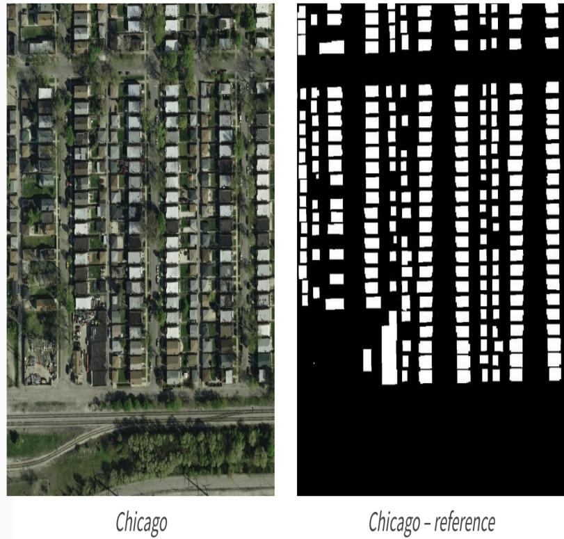

# 【AI入门系列】地球观察员：建筑物识别学习赛

# 赛题背景

无人机技术高速发展的今天，面对海量的航拍图像，AI如何识别地表建筑物呢？

赛题以计算机视觉为背景，要求选手使用给定的航拍图像训练模型并完成地表建筑物识别任务。为更好的引导大家入门，我们为本赛题定案和学习任务，具体包括语义分割的模型和具体的应用案例。在具体任务中我们将讲解具体工具和使用和完成任务的过程。

通过对本方案的完整学习，可以帮助掌握语义分割基本技能。同时我们也将提供专属的视频直播学习通道。

# 赛题描述及数据说明

遥感技术已成为获取地表覆盖信息最为行之有效的手段，遥感技术已经成功应用于地表覆盖检测、植被面积检测和建筑物检测任务。本赛题数据，需要参赛选手完成地表建筑物识别，将地表航拍图像素划分为有建筑物和无建筑物两类。

如下图，左边为原始航拍图，右边为对应的建筑物标注。



赛题数据来源（InriaAerialImageLabeling），并进行拆分处理。数据集报名后可见并可下载。赛题数据为航拍图，需要参赛选手识别图片建筑具体像素位置。

- train_mask.csv：存储图片的标注的rle编码；- train和test文件夹：存储训练集和测试集图片；

rle编码的具体的读取代码如下：

```python
import numpy as np
import pandas as pd
import cv2

# 将图片编码为rle格式
def rle_encode(im):
    '''
    im: numpy array, 1 - mask, 0 - background
    Returns run length as string formated
    '''
    pixels = im.flatten(order = 'F')
    pixels = np.concatenate([[0], pixels, [0]])
    runs = np.where(pixels[1:] != pixels[:-1])[0] + 1
    runs[1::2] -= runs[::2]
    return ' '.join(str(x) for x in runs)

# 将rle格式进行解码为图片
def rle_decode(mask_rle, shape=(512, 512)):
    '''
    mask_rle: run-length as string formated (start length)
    shape: (height,width) of array to return 
    Returns numpy array, 1 - mask, 0 - background

    '''
    s = mask_rle.split()
    starts, lengths = [np.asarray(x, dtype=int) for x in (s[0:][::2], s[1:][::2])]
    starts -= 1
    ends = starts + lengths
    img = np.zeros(shape[0]*shape[1], dtype=np.uint8)
    for lo, hi in zip(starts, ends):
        img[lo:hi] = 1
    return img.reshape(shape, order='F')
```

读取样例：

```python
train_mask = pd.read_csv('train_mask.csv', sep='\t', names=['name', 'mask'])

# 读取第一张图，并将对于的rle解码为mask矩阵
img = cv2.imread('train/'+ train_mask['name'].iloc[0])
mask = rle_decode(train_mask['mask'].iloc[0])

print(rle_encode(mask) == train_mask['mask'].iloc[0])
# 结果为True
```

# 评估标准

【AI入门系列】地球观察员：建筑物识别学习赛_学习赛_天池大赛- 阿里云天池的团队赛题使用Dice coefficient来衡量选手结果与真实标签的差异性，Dice coefficient 可以按像素差异性来比较结果的差异性。Dice coefficient的式如下：

$$
\frac{2*|X\cap Y|}{|X| + |Y|}
$$

其中X是预测结果，Y为真实标签的结果。当X与Y完全相同时 Dice coefficient 为1，排行榜使用所有测试集图片的平均 Dice coefficient 来值越大越好。

# 结果提交

提交前请确保预测结果的格式与test_sample_submit.csv中的格式一致，以及提交文件后缀名为csv。

# 注意事项：

- 第一列为rles图片名称，第二列为rle编码；- 如测试集图没有识别出结果，也需要提交空字符串；- 测试集图片顺序需要与test_sample_submit.csv保持一致；

# 比赛规则

为了比赛公平公正，所有参赛选手不允许使用任何外部数据集（如外部航拍数据）。同时所有参赛选手不允许使用任何非公开的预

型，公开的预训练模型（如ImageNet和COCO）可以使用。

为了比赛趣味性，不建议选手使用伪标签操作，同时建议选手保存好代码，最终比赛程序代码需要完整复现。
